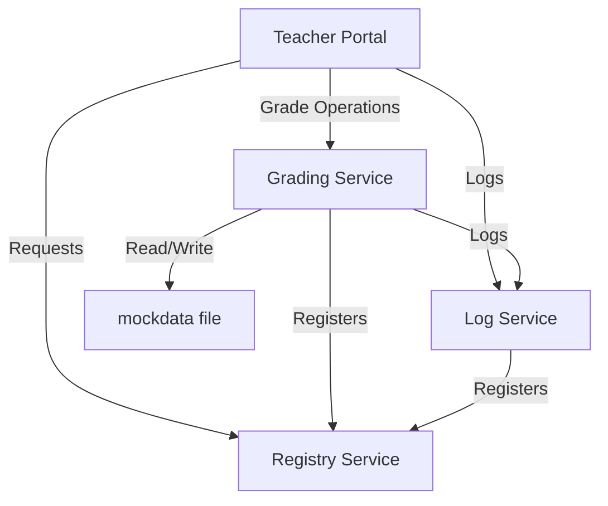

# Resultify

## Overview
Resultify is a distributed result grading portal built with Go, designed to streamline the process of managing and grading student results in educational institutions. The system uses a distributed microservices architecture with file-based data storage for simplicity and portability.

## System Components
1. **Registry Service**: Service discovery and registration
2. **Log Service**: Centralized logging for all services
3. **Grading Service**: Handles grade calculations and management, using file-based storage
4. **Teacher Portal**: Web interface for teachers to input and manage grades

## Technology Stack
- Go 1.16+
- File-based data storage

## Project Structure
```
resultify/
├── registry/         # Registry Service
│   └── main.go
├── logservice/       # Log Service
│   └── main.go
├── gradingservice/   # Grading Service
│   ├── main.go
│   └── grades/       # Grade data directory
│       └── mockdata  # File storing grade data
├── teacherportal/    # Teacher Portal Service
│   └── main.go
└── README.md
```

## Data Storage
The application uses file-based storage for maintaining grade data. The mock data is stored in the `gradingservice/grades/mockdata` file.

Example of data structure in mockdata file:
```
[
  {
    "studentId": "1",
    "courseId": "CS101",
    "grade": 85
  },
  {
    "studentId": "2",
    "courseId": "CS101",
    "grade": 92
  }
]
```

## Getting Started

### Installation
```bash
# Clone the repository
git clone https://github.com/SulaimonShittu/Resultify.git

# Navigate to the project directory
cd Resultify
```

### Running the Services
The services must be started in a specific order to ensure proper functioning:

1. First, start the Registry Service:
```bash
cd registry
go build
./registry
```

2. Next, start the Log Service:
```bash
cd ../logservice
go build
./logservice
```

3. Then, start the Grading Service:
```bash
cd ../gradingservice
go build
./gradingservice
```

4. Finally, start the Teacher Portal:
```bash
cd ../teacherportal
go build
./teacherportal
```

## Service Details

### Registry Service
- Handles service registration and discovery
- Maintains a list of all active services
- Default port: 3000

### Log Service
- Provides centralized logging for all services
- Receives and stores log messages from other services
- Default port: 8080

### Grading Service
- Manages grade data using file-based storage
- Performs grade calculations and analysis
- Reads and writes to the mockdata file
- Default port: 6000

### Teacher Portal
- Web interface for teachers
- Communicates with other services to display and manage grades
- Default port: 5000

## API Documentation

### Registry Service Endpoints

| Endpoint | Method | Description |
|----------|--------|-------------|
| `/services` | POST | Register a new service |
| `/services` | GET | Get all registered services |

### Grading Service Endpoints

| Endpoint | Method | Description |
|----------|--------|-------------|
| `/api/grades` | POST | Submit a new grade |
| `/api/grades/{studentId}` | GET | Get grades for a student |
| `/api/courses/{courseId}/grades` | GET | Get all grades for a course |

### Teacher Portal Endpoints

| Endpoint | Method | Description |
|----------|--------|-------------|
| `/` | GET | Main web interface |
| `/api/students` | GET | Get all students |
| `/api/courses` | GET | Get all courses |

## Service Communication Diagram



## Development Workflow
1. Ensure all required ports are available
2. Start all services in the order specified above
3. Access the Teacher Portal through your web browser (typically at http://localhost:3003)

## Testing
To run tests for each service:

```bash
# Test Registry Service
cd registry
go test ./...

# Test Log Service
cd ../logservice
go test ./...

# Test Grading Service
cd ../gradingservice
go test ./...

# Test Teacher Portal
cd ../teacherportal
go test ./...
```

## Troubleshooting
Common issues and their solutions:

1. **Services can't communicate**: Ensure the Registry Service is running and all services are properly registered
2. **File access issues**: Verify that the mockdata file exists and has proper read/write permissions
3. **Port conflicts**: Make sure each service is using a unique port

## Future Improvements
- Implement a database for more robust data storage
- Add authentication and authorization
- Implement caching for improved performance
- Add Docker support for easier deployment

## Contributing
We welcome contributions to Resultify! Please follow these steps:

1. Fork the repository
2. Create a new branch: `git checkout -b feature/feature-name`
3. Make your changes and commit: `git commit -m 'Add some feature'`
4. Push to the branch: `git push origin feature/feature-name`
5. Submit a pull request

## License
This project is licensed under the MIT License - see the [LICENSE](LICENSE) file for details.

## Contact
- Sulaimon Shittu
- GitHub: [@SulaimonShittu](https://github.com/SulaimonShittu)
